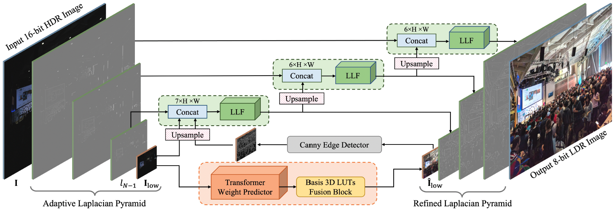

# Lookup Table meets Local Laplacian Filter: Pyramid Reconstruction Network for Tone Mapping (NeurIPS 2023)

**Technical Report**: <a href=''></a>


🚀🚀 Welcome to the repo of **LLF-LUT** 🚀🚀 

LLF-LUT is an effective end-to-end framework for the **HDR image tone mapping** task performing global tone manipulation while preserving local edge details. Specifically, we build a lightweight transformer weight predictor on the bottom of the Laplacian pyramid to predict the pixel-level content-dependent weight maps. The input HDR image is trilinear interpolated using the basis 3D LUTs and then multiplied with weighted maps to generate a coarse LDR image. To preserve local edge details and reconstruct the image from the Laplacian pyramid faithfully, we propose an image-adaptive learnable local Laplacian filter (LLF) to refine the high-frequency components while minimizing the use of computationally expensive convolution in the high-resolution components for efficiency.

## 🌟 Structure

The model architecture of LLF-LUT is shown below. Given an input 16-bit HDR image, we initially decompose it into an adaptive Laplacian pyramid, resulting in a collection of high-frequency components and a low-frequency image. The adaptive Laplacian pyramid employs a dynamic adjustment of the decomposition levels to match the resolution of the input image. This adaptive process ensures that the low-frequency image achieves a proximity of approximately 64 × 64 resolution. The described decomposition process possesses invertibility, allowing the original image to be reconstructed by incremental operations.



## :book: Citation
If you find our LLF-LUT model useful for you, please consider citing :mega:
```bibtex
```

## :email:Contact
If you have any question, feel free to email fengzhangaia@hust.edu.cn.
